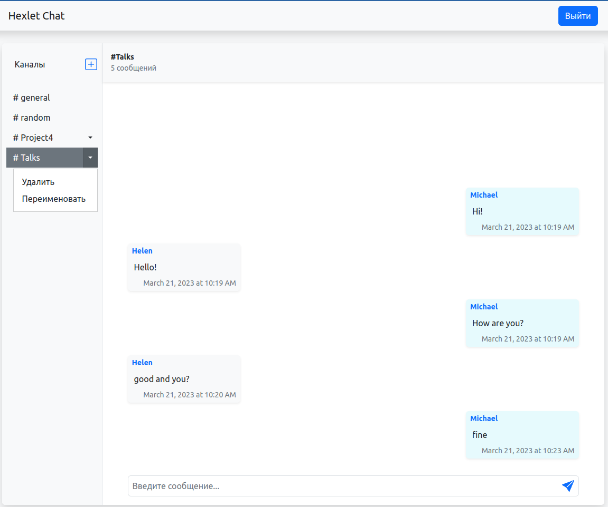

### Hexlet tests and linter status:
[](https://github.com/MikRyam/frontend-project-12/actions)
[](https://codeclimate.com/github/MikRyam/frontend-project-12/maintainability)

## [Chat App](https://frontend-project-12-production-241a.up.railway.app/)


## Description

Realtime chat application with React.js, Socket.io, JWT authorization.
You can login, signup, logout. You can creat, rename or remove channels and send messages.

---

## App Preview:




---

## Stack:
- React
- JavaScript
- Redux Toolkit
- RTK Query
- LocalStorage
- Socket.IO
- Bootstrap
- i18next
- Leo-profanity
- Rollbar
- ESLint
- Prettier

---

## Requirements

You need to have installed actual versions of **Node.js** and **npm** packages.

To see if you already have **Node.js** and **npm** installed and check the installed version,  
run the following commands:

```bash
node -v
npm -v
```

---


## Setup

```bash
git clone git@github.com:MikRyam/frontend-project-12.git
cd frontend-project-12

make install
```

## Getting Started

```bash
make start
```
The development server will be started at http://0.0.0.0:5001/

## Other available scripts

```bash
# run Eslint
make lint

make lint-fix

```

## Bundle application

```bash
# run build
make build
```
